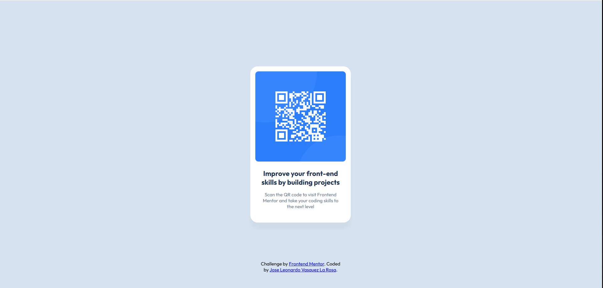

# Frontend Mentor - QR code component solution

This is a solution to the [QR code component challenge on Frontend Mentor](https://www.frontendmentor.io/challenges/qr-code-component-iux_sIO_H). Frontend Mentor challenges help you improve your coding skills by building realistic projects. 

## Table of contents

- [Overview](#overview)
  - [Screenshot](#screenshot)
  - [Links](#links)
- [My process](#my-process)
  - [Built with](#built-with)
  - [What I learned](#what-i-learned)
  - [Continued development](#continued-development)
  - [Useful resources](#useful-resources)
- [Author](#author)

## Overview

### Screenshot



### Links

- Solution URL: [Add solution URL here](https://your-solution-url.com)
- Live Site URL: [Add live site URL here](https://your-live-site-url.com)

## My process

### Built with

- Semantic HTML5 markup
- Flexbox
- Mobile-first workflow

### What I learned

I actually, as far as i can remember haven't use the import on CSS for the font before:

```css
@import url("https://fonts.googleapis.com/css2?family=Outfit:wght@100..900&display=swap");
```

and i also remembered some of the text aling properties on CSS: 

```css
.text-container{
    text-align: center;
    justify-items: center;
}
```

### Continued development

CSS overall

### Useful resources

- [figma](https://www.figma.com/) - This helped me to accurately see the desing and the spaces between the img and text, i also learn a bit more about figma

## Author

- Frontend Mentor - [@JoseLeoV77](https://www.frontendmentor.io/profile/JoseLeoV77)


